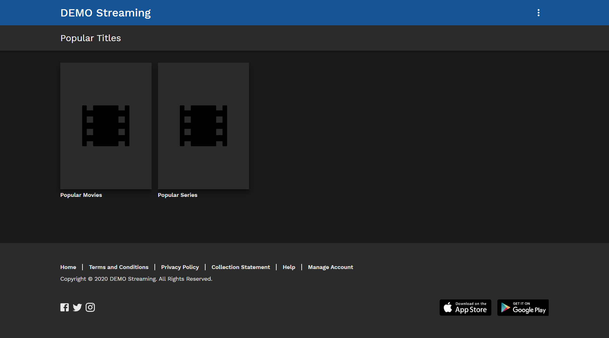

# Movie Library w/ ReactJS

## [Check it live here](https://remote-roofing-moviebox.web.app/)



A Movie Library made with ReactJS using remote roofing api and the movie db api

## Getting Started

These instructions will get you a copy of the project up and running on your local machine for development and testing purposes. See deployment for notes on how to deploy the project on a live system.


### Installing

Clone the Repository and run

```
npm install
npm run start
```

## Deployment

To deploy simply run

```
npm run build
```


## Built With

- [React JS](https://reactjs.org/)
- [React Router](https://github.com/ReactTraining/react-router)
- [Redux](https://redux.js.org/)
- [Redux Thunk](https://github.com/reduxjs/redux-thunk)
- [Material Ui](https://material-ui.com/)
- [Typescript](https://www.typescriptlang.org/)
- [Firebase](https://firebase.google.com/)

## Preliminary Questions

1. **How did you decide on the technical and architectural choices used as part of your solution?**
    
    * From the starting of the project my main intention was, to make the app structure modular and type-safe so that I can have the least amount of bugs while coding and in production.
   
    * Due to this, I used typescript along with react and created a modular structure for redux with type safety.
  
    * The major part of the app was the initial type-safe modular code setup and to be honest, it took me 3 days to setup the boilerplate but after that i was able to finish the functionality i intended to create much faster.
  
    *  I realized that utilizing the time to build up the base is much better than getting stuck in the long run.


2. **Are there any improvements you could make to your submission?**

   * Well i am not sure about this. 

3. **What would you do differently if you were allocated more time?**

    * I worked on the app in a way that I didn't want any workarounds but due to time limitation, I had to do some workarounds. I wouldn't do that if I did get more time, i would've researched over it very well and would find a better solutions.


## Authors

- **Mohib** - _Development_ - [Mohib](https://github.com/Mohib834)
